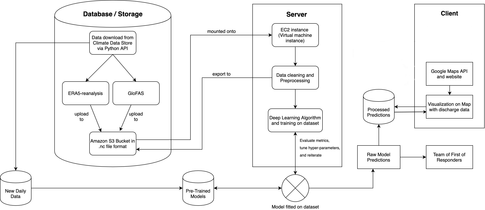
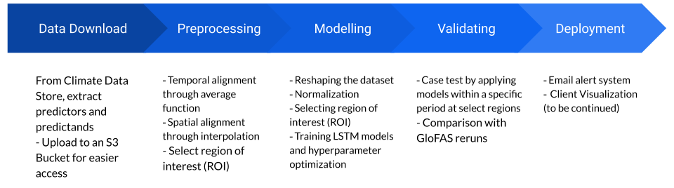

<h3 align="center">
  
</h3>

# Tunisian Integrated Water Resource Management and Urban Resilience System 
A deep learning approach to flood forecasting has been explored in this project as a way to produce flood models that are scalable globally using  **RNN** (Recurrent Neural Net) **LSTM** (Long Short-Term Memory) implemented in Python 3.7/Keras.

The project has been deployed on a [website]('https://floodai.tech') equipped with flood mapping visualization and a live user alert system. [source](https://towardsdatascience.com/cartpole-introduction-to-reinforcement-learning-ed0eb5b58288)

## Project Origin
Fighting climate change is one of the top priorities in our century. After finding out that floods are the most common and wide-reaching type of climate disaster, and realizing that there was a deep lack of innovation in this domain, I decided to undertake this as a science fair project.

## Abstract
> Flooding events not only cause significant damage to infrastructure and human populations but also result in the loss of vast amounts of potentially usable water. Between 1995 and 2015, over 2.3 billion people globally were affected by floods (Wallamacq et al., 2015), highlighting the urgent need for effective management strategies. In Tunisia, where water scarcity poses a persistent challenge, floods exacerbate the crisis by wasting valuable water that could be harnessed for future use.

The Tunisian Integrated Water Resource Management and Urban Resilience System (TIWRMURS) aims to turn the challenges posed by flooding into opportunities by identifying, storing, and optimizing the use of floodwaters. By leveraging satellite data from Sentinel-1 SAR for water body detection, Sentinel-2 for land classification, and SRTM DEM for topographic analysis, coupled with IoT sensors for real-time monitoring, the system identifies flood-prone zones and potential water storage sites. These insights enable the efficient manipulation of floodwaters into reservoirs, recharge zones, or sustainable agricultural systems.

The platform provides actionable data through an interactive dashboard, showcasing flood risk zones, infrastructure at risk, and water storage opportunities. It empowers decision-makers to mitigate flood damage, conserve water resources, and plan resilient urban infrastructure. This innovative approach not only addresses the immediate threats of flooding but also transforms excess water into a resource, offering a scalable solution to Tunisia's ongoing water crisis while promoting sustainable development.

## Project Workflow

 
## Machine Learning Pipeline

## Datasets

## Data Processing

## Long Short-Term Memory (LSTM)
Our team collaboratively experimented with the Long Short-Term Memory (LSTM) network, a variation of recurrent neural networks (RNNs) specifically designed to store information over extended periods using dedicated memory cells. Unlike traditional RNNs, LSTMs overcome the challenges of exploding and vanishing gradients, making them highly effective in capturing long-term dependencies between input and output features. This capability is particularly valuable for modeling extreme-weather events, where the timescale between the input data and resulting outputs can span significant durations.  

We also recognized LSTMs' demonstrated ability to model complex, nonlinear interactions across multiple dimensions (Ogunmulu et al., 2016), which proved critical for addressing the multifaceted nature of flooding. Floods are influenced by a wide range of factors that interact in nonlinear and dynamic ways, often deviating from simple linear relationships, such as discharge rates. By leveraging LSTMs' strengths, our team aimed to build more robust and accurate modern forecasting models capable of better understanding and predicting these intricate environmental phenomena. 

### Hyperparameters:

    BATCH_SIZE = 32
	SEQUENCE_LENGTH = 50
	LEARNING_RATE = 0.01
	DECAY_RATE = 0.97
	HIDDEN_LAYER_SIZE = 256
	CELLS_SIZE = 2

### Model structure:

1. Dense layer - input: **4**, output: **24**, activation: **relu**
2. Dense layer - input **24**, output: **24**, activation: **relu**
3. Dense layer - input **24**, output: **2**, activation: **linear**

* **RMSE** loss function
* **Adam** optimizer

## Results

> CartPole-v0 defines "solving" as getting average reward of 195.0 over 100 consecutive trials. [source](https://gym.openai.com/envs/CartPole-v0/)
> 

##### Example trial chart

##### Solved trials chart

